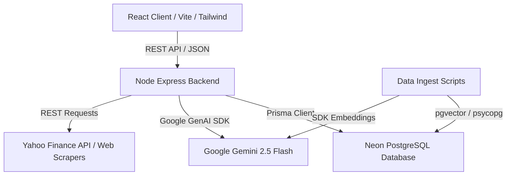

# FinPulse AI: AI-Powered Financial News & Trading Analytics

FinPulse AI is a professional, high-performance financial intelligence dashboard that enables retail and institutional investors to track global market clocks, analyze assets via advanced stock screeners, simulate trading portfolios, set custom alerts, and gather AI-driven market sentiment briefings. 

The application utilizes a robust client-server model: a responsive **React 19** frontend powered by Vite and Tailwind CSS, coupled with a typed **Express.js** API backend, PostgreSQL database access via **Prisma ORM**, and deep integration with **Google Gemini AI** for embeddings, RAG pipelines, and market trend synthesis.

---

## 🚀 Key Features

*   **Financial Market Clocks & Indices:** Interactive timezone monitoring, global exchanges tracking, and realtime indexing of S&P 500 (`^GSPC`), NASDAQ (`^IXIC`), and Dow Jones (`^DJI`).
*   **Dynamic Stock Screener:** Advanced search and screening of NSE/BSE and global tickers. Provides detailed metrics: P/E Ratios, Dividend Yields, ROE, ROCE, Book Value, 52-week High/Low, and historical composed price charts.
*   **A.I. Market Sentiment Coach:** Automatic sentiment analysis of breaking news feeds, AI ranking cards, sector streaks, volatility gauges, Fear & Greed indexes, and summaries powered by the **Google Gemini API**.
*   **Simulated Portfolio (Paper Trading):** Manage virtual investment balances, place buy/sell orders, track live holdings value, audit transaction histories, and visualize performance benchmarks over time.
*   **Alerts & Custom Watchlists:** Set conditional triggers (Price, Volume, Percent Change) and organize tickers inside watchlists equipped with personalized tags and note boards.
*   **RAG Knowledge Base:** Python pipelines that vectorize corporate reports, news files, or filings with `gemini-embedding-001` (1536 dimensions) into a PostgreSQL `pgvector` store, enabling context-specific AI Q&A.

---

## 🏗️ System Architecture



---

## 🛠️ Technology Stack

### Frontend Client
*   **Framework:** React 19 (TypeScript, Vite)
*   **Styling:** Tailwind CSS, Framer Motion (micro-animations)
*   **Data Vis:** Recharts (composed charts, radar benchmarks), TradingView Lightweight Charts
*   **State & Routing:** TanStack React Query v5, React Router DOM, React Hot Toast

### Backend Server
*   **Runtime:** Node.js, Express.js (TypeScript, ESM)
*   **Database ORM:** Prisma Client connecting to a Serverless Neon PostgreSQL database
*   **Third-party APIs:** Yahoo Finance (`yahoo-finance2`), rss-parser, technicalindicators, Axios
*   **Mailer Service:** Nodemailer SMTP integration for password and OTP flows
*   **AI SDK:** `@google/genai` for embedding/retrieval prompts

---

## 💻 Installation & Setup

### 📦 Prerequisites
*   **Node.js** (v18 or higher)
*   **Python 3.10+** (if running the offline embedding ingestion)
*   **PostgreSQL** database (e.g. Neon Cloud) with the `pgvector` extension enabled.

---

### 🗄️ 1. Backend Setup & Configuration
1. Navigate to the backend folder:
   ```bash
   cd finpulse-web/backend
   ```
2. Install package dependencies:
   ```bash
   npm install
   ```
3. Create a `.env` file in `finpulse-web/backend` and configure the following variables:
   ```env
   PORT=3000
   DATABASE_URL="postgresql://<user>:<password>@<host>/neondb?sslmode=require"
   GEMINI_API_KEY="your-gemini-api-key"
   JWT_SECRET="your-jwt-signing-secret"
   GOOGLE_CLIENT_ID="your-google-oauth-client-id"
   FINNHUB_API_KEY="your-finnhub-api-key"
   TWELVEDATA_API_KEY="your-twelvedata-api-key"
   ALPHA_VANTAGE_API_KEY="your-alpha-vantage-api-key"
   SMTP_HOST="smtp.gmail.com"
   SMTP_PORT=587
   SMTP_USER="your-email@gmail.com"
   SMTP_PASS="your-app-password"
   ```
4. Push database tables and generate the Prisma Client:
   ```bash
   npx prisma db push
   npx prisma generate
   ```
5. Run the dev server:
   ```bash
   npm run dev
   ```

---

### 🎨 2. Frontend Setup
1. Navigate to the client folder:
   ```bash
   cd finpulse-web
   ```
2. Install package dependencies:
   ```bash
   npm install
   ```
3. Create a `.env` file in `finpulse-web`:
   ```env
   VITE_FINNHUB_API_KEY="your-finnhub-api-key"
   VITE_TWELVEDATA_API_KEY="your-twelvedata-api-key"
   ```
4. Run the web dev server:
   ```bash
   npm run dev
   ```

---

### 🤖 3. RAG Pipeline Ingestion
1. Install Python packages:
   ```bash
   pip install psycopg google-genai python-dotenv
   ```
2. Run the ingestion pipeline to parse and load documents into database vectors:
   ```bash
   python ingest_data.py
   ```
3. Test similarity searches and Gemini Q&A:
   ```bash
   python query_pipeline.py
   ```

---

## ⚖️ Compliance & Disclosures
FinPulse AI is a simulation and data tracking platform. It is **not** registered as an investment advisor (e.g. with SEBI, SEC). All financial information, AI-generated predictions, and performance mock-ups are strictly for educational and paper-trading purposes. Mandatory risk disclaimers are presented clearly across all interactive pages.
