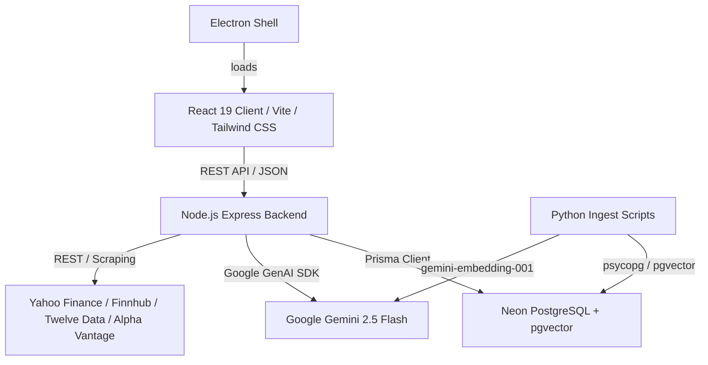

# FinPulse AI

A professional, full-stack financial intelligence platform that combines real-time market data, AI-driven sentiment analysis, paper trading simulation, and a RAG-powered knowledge base. Available as both a web application and a packaged Electron desktop application.

---

## Table of Contents

- [Overview](#overview)
- [Key Features](#key-features)
- [System Architecture](#system-architecture)
- [Technology Stack](#technology-stack)
- [Project Structure](#project-structure)
- [Installation and Setup](#installation-and-setup)
  - [Prerequisites](#prerequisites)
  - [Backend Setup](#1-backend-setup)
  - [Frontend Setup](#2-frontend-setup)
  - [Electron Desktop App](#3-electron-desktop-app)
  - [RAG Pipeline Ingestion](#4-rag-pipeline-ingestion)
- [Environment Variables Reference](#environment-variables-reference)
- [Deployment](#deployment)
- [Production Keep-Alive](#production-keep-alive)
- [Compliance and Disclosures](#compliance-and-disclosures)
- [License](#license)

---

## Overview

FinPulse AI enables retail and institutional investors to monitor global markets, screen equities with advanced financial metrics, manage virtual paper-trading portfolios, and receive AI-generated market briefings powered by Google Gemini. The platform is built on a typed React 19 frontend and an Express.js backend with PostgreSQL persistence via Prisma ORM.

---

## Key Features

- **Market Clocks and Global Indices:** Real-time timezone monitoring for major exchanges and live tracking of S&P 500 (`^GSPC`), NASDAQ (`^IXIC`), and Dow Jones (`^DJI`).
- **Advanced Stock Screener:** Search and filter NSE, BSE, and global tickers. Displays P/E Ratios, Dividend Yields, ROE, ROCE, Book Value, 52-week High/Low, and interactive historical price charts via TradingView Lightweight Charts.
- **AI Market Sentiment Coach:** Automatic sentiment analysis of breaking news, sector streak cards, volatility gauges, Fear and Greed Index visualization, and Gemini-generated market summaries.
- **Paper Trading Portfolio:** Place simulated buy/sell orders, track live holding values, review full transaction histories, and benchmark performance over time using Recharts composed charts.
- **Alerts and Watchlists:** Set conditional price, volume, and percent-change triggers. Organize tickers in watchlists with personalized tags and notes.
- **RAG Knowledge Base:** Python ingestion pipelines vectorize financial reports, news articles, and SEC/regulatory filings using `gemini-embedding-001` (1536 dimensions) into a PostgreSQL `pgvector` store for context-aware AI question-and-answer.
- **Electron Desktop Application:** The full web interface packaged as a native Windows desktop application using Electron and electron-builder.
- **Authentication:** JWT-based session management with Google OAuth support and SMTP-delivered OTP flows via Nodemailer/Brevo.

---

## System Architecture


```mermaid
graph TD
    A[React 19 Client / Vite / Tailwind CSS] -->|REST API / JSON| B[Node.js Express Backend]
    B -->|Prisma Client| C[Neon PostgreSQL + pgvector]
    B -->|Google GenAI SDK| D[Google Gemini 2.5 Flash]
    B -->|REST / Scraping| E[Yahoo Finance / Finnhub / Twelve Data / Alpha Vantage]
    F[Python Ingest Scripts] -->|psycopg / pgvector| C
    F -->|gemini-embedding-001| D
    G[Electron Shell] -->|loads| A
```

**API Route Groups (all prefixed `/api`):**

| Route Group | Prefix | Purpose |
|---|---|---|
| Search | `/api/search` | Ticker and asset search |
| News | `/api/news` | Financial news feed aggregation |
| AI | `/api/ai` | Gemini sentiment and Q&A endpoints |
| Assets | `/api/assets` | Detailed quote and historical data |
| Auth | `/api/auth` | Registration, login, Google OAuth, OTP |
| Profile | `/api/profile` | User account and settings management |
| Watchlists | `/api/watchlists` | Watchlist CRUD and alert management |
| Portfolio | `/api/portfolio` | Paper trading orders and holdings |

---

## Technology Stack

### Frontend

| Category | Technology |
|---|---|
| Framework | React 19 (TypeScript, Vite 8) |
| Styling | Tailwind CSS 3, tailwindcss-animate |
| Animation | Framer Motion 12 |
| Charting | Recharts 3, TradingView Lightweight Charts 4 |
| State / Data Fetching | TanStack React Query v5 |
| Routing | React Router DOM v7 |
| Auth | @react-oauth/google |
| Icons | Lucide React |
| Notifications | React Hot Toast |

### Backend

| Category | Technology |
|---|---|
| Runtime | Node.js 20 (ESM, TypeScript) |
| Framework | Express.js 5 |
| ORM | Prisma 7 with @prisma/adapter-pg |
| Database | Neon PostgreSQL (serverless) with pgvector |
| Financial Data | yahoo-finance2, Finnhub, Twelve Data, Alpha Vantage |
| News | rss-parser, google-news-rss |
| AI | @google/genai (Gemini 2.5 Flash) |
| Auth | jsonwebtoken, bcryptjs |
| Mail | Nodemailer, Brevo |
| Utilities | Axios, Cheerio, node-cache, express-rate-limit, compression |

### Desktop

| Category | Technology |
|---|---|
| Shell | Electron 43 |
| Packaging | electron-builder 26 (NSIS installer for Windows) |

---

## Project Structure

```
FinPulse-AI/
├── finpulse-web/
│   ├── backend/                  # Express.js API server
│   │   ├── prisma/               # Prisma schema and migrations
│   │   └── src/
│   │       ├── routes/           # search, news, ai, assets, auth, profile, watchlists, portfolio
│   │       └── index.ts          # Server entry point
│   ├── electron/                 # Electron main process and assets
│   ├── frontend/                 # React 19 client
│   │   └── src/
│   │       ├── features/         # Dashboard, FearGreedIndex, etc.
│   │       └── pages/            # StockScreener, AssetDetails, Profile, News, About, etc.
│   └── package.json              # Electron root workspace config
├── render.yaml                   # Render.com deployment configuration
└── LICENSE                       # Apache 2.0
```

---

## Installation and Setup

### Prerequisites

- **Node.js** v18 or higher (v20 recommended)
- **npm** v9 or higher
- **Python 3.10+** (required only for the RAG ingestion pipeline)
- A **PostgreSQL** database with the `pgvector` extension enabled (e.g., [Neon](https://neon.tech))

---

### 1. Backend Setup

**Navigate to the backend directory:**
```bash
cd finpulse-web/backend
```

**Install dependencies:**
```bash
npm install
```

**Configure proxy rotation (optional but recommended):**

To reduce rate-limiting from financial data providers, create a `proxies.txt` file in `finpulse-web/backend` with one proxy per line:
```
ip:port
username:password@ip:port
```

**Create the environment file:**

Create a `.env` file in `finpulse-web/backend` (see [Environment Variables Reference](#environment-variables-reference) for the full list):
```env
PORT=3000
DATABASE_URL="postgresql://<user>:<password>@<host>/neondb?sslmode=require"
GEMINI_API_KEY="your-gemini-api-key"
JWT_SECRET="your-jwt-signing-secret"
GOOGLE_CLIENT_ID="your-google-oauth-client-id"
FINNHUB_API_KEY="your-finnhub-api-key"
TWELVEDATA_API_KEY="your-twelvedata-api-key"
ALPHA_VANTAGE_API_KEY="your-alpha-vantage-api-key"
SMTP_HOST="smtp.gmail.com"
SMTP_PORT=587
SMTP_USER="your-email@gmail.com"
SMTP_PASS="your-app-password"
SMTP_SECURE=false
BREVO_API_KEY="your-brevo-api-key"
SENDER_EMAIL="your-sender-email"
FRONTEND_URL="http://localhost:5173"
```

**Push the database schema and generate the Prisma client:**
```bash
npx prisma db push
npx prisma generate
```

**Start the development server:**
```bash
npm run dev
```

The API will be available at `http://localhost:3000`. Visit `/health` for a status check.

---

### 2. Frontend Setup

**Navigate to the frontend directory:**
```bash
cd finpulse-web/frontend
```

**Install dependencies:**
```bash
npm install
```

**Create the environment file:**

Create a `.env` file in `finpulse-web/frontend`:
```env
VITE_API_URL="http://localhost:3000"
VITE_FINNHUB_API_KEY="your-finnhub-api-key"
VITE_TWELVEDATA_API_KEY="your-twelvedata-api-key"
```

**Start the development server:**
```bash
npm run dev
```

The web client will be available at `http://localhost:5173`.

---

### 3. Electron Desktop App

Ensure both the backend server is running and the frontend has been built before launching the desktop application.

**Build the frontend:**
```bash
cd finpulse-web/frontend
npm run build
```

**Launch in development mode:**
```bash
cd finpulse-web
npm run electron
```

**Package a distributable installer (Windows NSIS):**
```bash
cd finpulse-web
npm run dist
```

The installer will be output to `finpulse-web/release/`.

---

### 4. RAG Pipeline Ingestion

This step is only required to populate the AI knowledge base with vectorized financial documents.

**Install Python dependencies:**
```bash
pip install psycopg google-genai python-dotenv
```

**Run the ingestion pipeline:**
```bash
python ingest_data.py
```

**Verify with a similarity search test:**
```bash
python query_pipeline.py
```

---

## Environment Variables Reference

### Backend (`finpulse-web/backend/.env`)

| Variable | Required | Description |
|---|---|---|
| `PORT` | Yes | Port the Express server listens on (default: `3000`) |
| `DATABASE_URL` | Yes | PostgreSQL connection string with `sslmode=require` |
| `GEMINI_API_KEY` | Yes | Google Gemini API key for AI features |
| `JWT_SECRET` | Yes | Secret used to sign and verify JSON Web Tokens |
| `GOOGLE_CLIENT_ID` | Yes | Google OAuth 2.0 client ID |
| `SMTP_HOST` | Yes | SMTP server host for transactional email |
| `SMTP_PORT` | Yes | SMTP server port (e.g., `587`) |
| `SMTP_USER` | Yes | SMTP username / sender address |
| `SMTP_PASS` | Yes | SMTP password or app password |
| `SMTP_SECURE` | No | Set to `true` for TLS on port 465 |
| `BREVO_API_KEY` | No | Brevo (Sendinblue) API key as an alternative mailer |
| `SENDER_EMAIL` | No | Override sender address for outgoing mail |
| `FRONTEND_URL` | No | Comma-separated list of allowed CORS origins |
| `NODE_ENV` | No | Set to `production` in deployed environments |

### Frontend (`finpulse-web/frontend/.env`)

| Variable | Required | Description |
|---|---|---|
| `VITE_API_URL` | Yes | Base URL of the backend API |
| `VITE_FINNHUB_API_KEY` | No | Finnhub key for direct client-side data calls |
| `VITE_TWELVEDATA_API_KEY` | No | Twelve Data key for direct client-side chart data |

---

## Deployment

FinPulse AI ships with a `render.yaml` file for one-click deployment to [Render](https://render.com).

**Services defined:**

| Service | Type | Root Directory |
|---|---|---|
| `finpulse-backend` | Web Service (Node.js) | `finpulse-web/backend` |
| `finpulse-frontend` | Static Site | `finpulse-web/frontend` |

The frontend `VITE_API_URL` and backend `FRONTEND_URL` are automatically cross-linked between the two services via Render's `fromService` environment variable injection.

**To deploy:**
1. Fork or push this repository to GitHub.
2. Connect the repository to your Render account.
3. Render will detect `render.yaml` and provision both services automatically.
4. Set the secret environment variables (marked `sync: false` in `render.yaml`) via the Render dashboard.

---

## Production Keep-Alive

Render's free tier suspends inactive services after 15 minutes, resulting in cold-start latency on the first request. To prevent this, an external cron scheduler pings the backend health endpoint at a regular interval.

- **Target endpoint:** `https://<your-backend>.onrender.com/health`
- **Interval:** Every 10 minutes
- **Recommended service:** [cron-job.org](https://cron-job.org)

---

## Compliance and Disclosures

FinPulse AI is a data aggregation and paper-trading simulation platform. It is **not** registered as an investment advisor with any regulatory body (including SEBI or the SEC). All financial data, AI-generated analysis, and portfolio simulations are strictly for **educational and informational purposes only** and do not constitute financial advice. Mandatory risk disclaimers are displayed across all interactive sections of the application.

---

## License

This project is distributed under the [Apache License 2.0](LICENSE).
